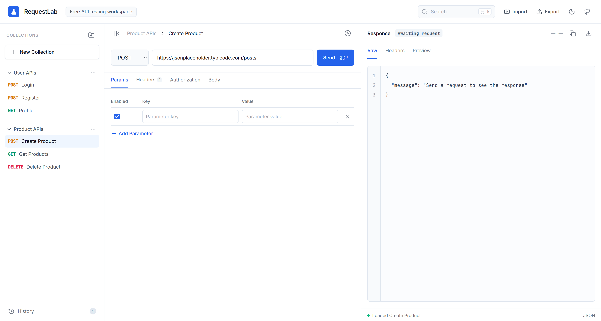

# 🚀 RequestLab

A modern and lightweight API testing workspace for developers to create, organize, and test REST APIs with an intuitive interface.



## ✨ Features

- 📂 Organize requests into collections
- 🌐 Support for REST API requests
- 🔥 HTTP methods (GET, POST, PUT, PATCH, DELETE)
- 📝 Add query parameters
- 🔑 Authorization support
- 📋 Custom request headers
- 📦 JSON request body editor
- 📨 Response viewer
  - Raw Response
  - Headers
  - Preview
- 💾 Import & Export collections
- 🕒 Request History
- 🎨 Clean and responsive UI

---

## 📸 Preview

> API Testing Workspace


---

## 🛠️ Tech Stack

- **Frontend:** React.js / Next.js _(Update accordingly)_
- **Styling:** Tailwind CSS
- **HTTP Client:** Axios / Fetch API
- **State Management:** React Context / Redux _(if applicable)_
- **Build Tool:** Vite _(or CRA/Next.js)_

---

## 📁 Project Structure

```text
RequestLab/
│
├── public/
├── src/
│   ├── components/
│   ├── pages/
│   ├── hooks/
│   ├── services/
│   ├── utils/
│   └── assets/
│
├── package.json
├── README.md
└── vite.config.js
```

---

## 🚀 Getting Started

### Clone the repository

```bash
git clone https://github.com/yourusername/requestlab.git
```

### Navigate into the project

```bash
cd requestlab
```

### Install dependencies

```bash
npm install
```

### Start the development server

```bash
npm run dev
```

The application will be available at:

```
http://localhost:5173
```

---

## 📌 Usage

1. Create a new collection.
2. Add an API request.
3. Select the HTTP method.
4. Enter the endpoint URL.
5. Configure:
   - Parameters
   - Headers
   - Authorization
   - Request Body
6. Click **Send**.
7. View the response in:
   - Raw
   - Headers
   - Preview

---

## 📦 Supported HTTP Methods

- GET
- POST
- PUT
- PATCH
- DELETE

---

## 🎯 Future Improvements

- Authentication (JWT/OAuth)
- Environment Variables
- API Variables
- GraphQL Support
- WebSocket Testing
- Code Snippets (cURL, Axios, Fetch)
- Dark Mode
- Team Collaboration
- Response Time Analytics
- Automated API Testing
- API Documentation Generator

---

## 🤝 Contributing

Contributions are welcome!

1. Fork the repository
2. Create your feature branch

```bash
git checkout -b feature/NewFeature
```

3. Commit your changes

```bash
git commit -m "Add NewFeature"
```

4. Push to the branch

```bash
git push origin feature/NewFeature
```

5. Open a Pull Request

---

## 📄 License

This project is licensed under the **MIT License**.

## 👨‍💻 Author

**Arnav Gupta**

GitHub: https://github.com/Arnav-Gupta-CR7
Live link: https://reqlab.netlify.app/

---

⭐ If you like this project, don't forget to **star the repository!**
